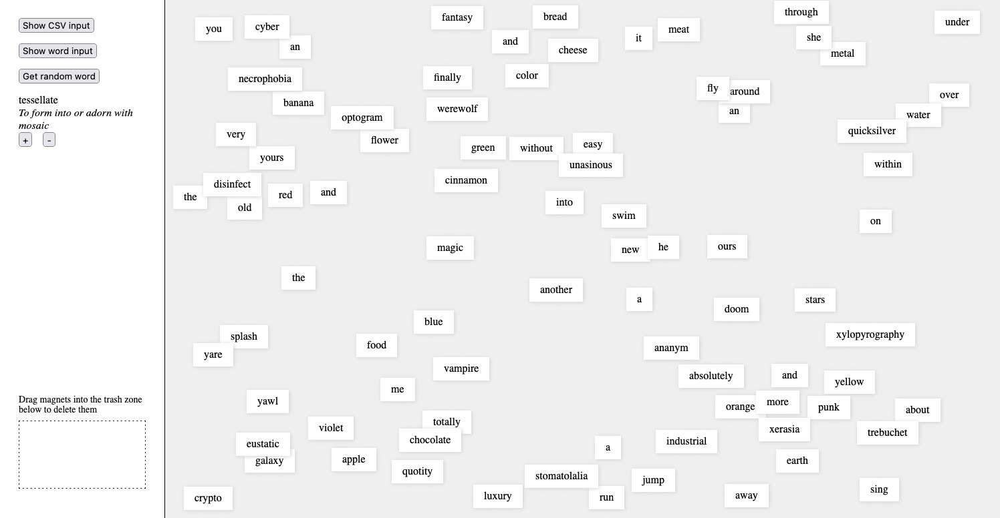

Super simple create-react-app for playing with words like fridge magnets

Play here: [fridge-omega.vercel.app](https://fridge-omega.vercel.app/)

Create magnet words one at a time with the single word input or import a single-column csv file of words/phrases to generate many magnets at once.

Uses [React DnD](https://github.com/react-dnd/react-dnd) for drag-and-drop, and [PapaParse](https://react-papaparse.js.org/) for CSV parsing
